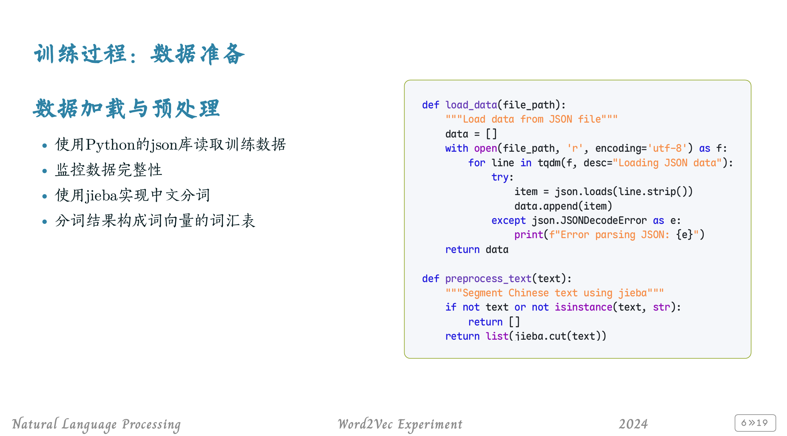
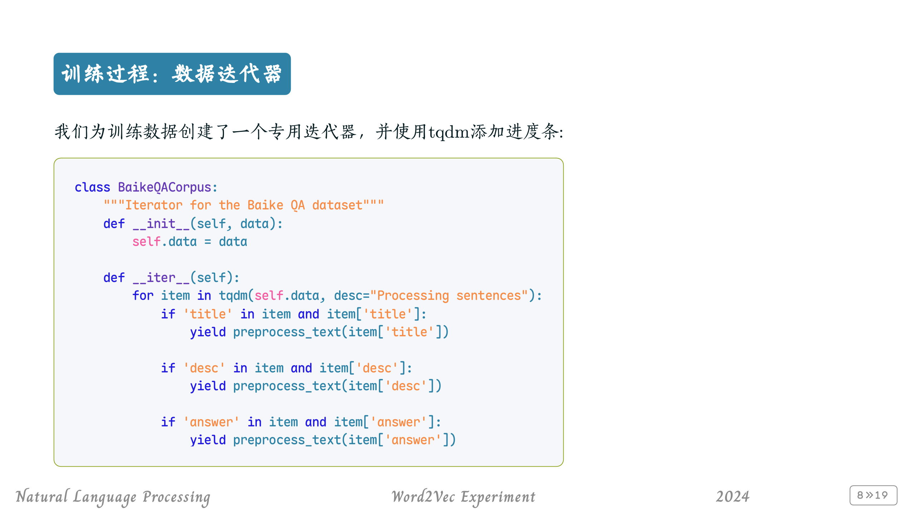
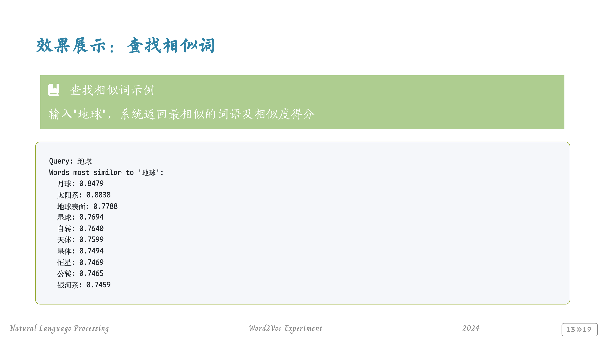
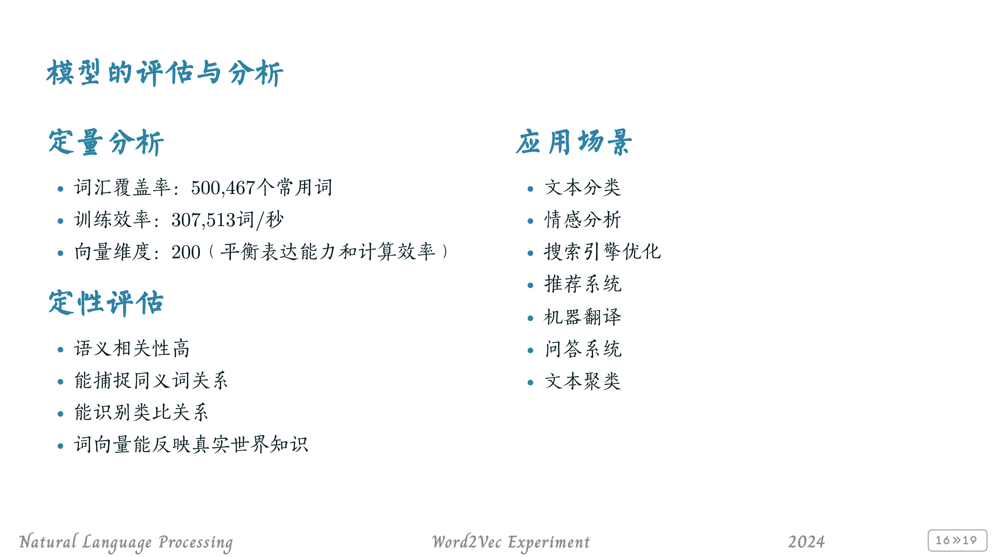

# Marp Slides

## What's this repo?

This is my personal repository containing all slides made from [Marp (Markdown Presentation)](https://github.com/marp-team/marp) and [Awesome-Marp (an elegant set of themes for Marp)](https://github.com/favourhong/Awesome-Marp).

You can also use this repository as a place to write your own marp-markdowns. Follow the tutorial on [Marp's official website](https://marp.app/) to get started in working with vscode to write marp-markdown, and then clone this repository to compile `projects/test/test.md` to pdf to see the effects.

**`awesome_marp.prompt.md` is the gold here: it teaches AI how to use awesome-marp as template for your ppt. All you need to do is to slam the AI your topic/text/... and it'll make an extraodinary ppt for you, perhaps after a little tweaking by yourself.**

# Showcases

